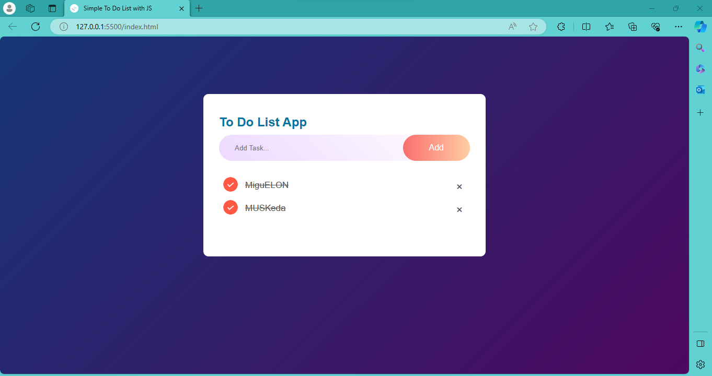

#To Do List App

~~~
//SELECT CLASSES FROM HTML
const inputBox = document.getElementById('input-box');
const listContainer = document.getElementById('list-container');

//adding click function to the button [in HTML onclick="addTask()"]

function addTask() {
  if (inputBox.value === '') {
    alert("You must write something");
    
//so this happen when click button and dont have any task in the input text field

}
  else {  //create a new li element    
  //this line create and stores new element in the "li" variable
    let li = document.createElement("li"); 
    //this detect the text we added in the input so we are adding li overwritten with your task the li in the HTML
    li.innerHTML = inputBox.value;
    //this displays the li
    listContainer.appendChild(li);
***************up to here the app still holds and keep the li so we need to add code to erase the task for addinga new task*********
↓//this add cross icon at the end of the task list item //"\u00d7" is the cros icon code
↓    let span = document.createElement("span");
↓    span.innerHTML = "\u00d7"
↓    li.appendChild(span);
↓  }
→ inputBox.value = '';
  saveData();
}

listContainer.addEventListener("click", function (e) {
  //The code inside this listener event will be executed whenever there is a click on an item within.. WHAT IT MEANS IS THAT WHENEVER YOU CLICK THE TASK, THE TASK WILL APPEAR CHECHED WITH A MID-LINE AND THE CHECKED IMG. IF YOU CLICK IT TWICE THE TASK WILL BE UNCHECKED ALSO.
  //the list container. If the clicked item was a span, remove it from its parent li
  if (e.target.tagName === 'LI') {
    e.target.classList.toggle("checked");
    saveData();
  }
  else if (e.target.tagName === "SPAN") {
    e.target.parentElement.remove();
    saveData();
  }
}, false);

//FUNCTION TO STORE DATA THAT MEANS IF YOU ARE GONE AND CLOSE BROWSER, THE BROWSER WILL KEEP DAT OF YOUR TASKS** CHECK IT OUT THAT YOU HAVE savedata() in the other functions also.
function saveData() {
  localStorage.setItem("data", listContainer.innerHTML);
}

function showTask() {
  listContainer.innerHTML = localStorage.getItem("data");
}
showTask();
~~~

>taken from https://www.youtube.com/watch?v=G0jO8kUrg-I&>ab_channel=GreatStack
